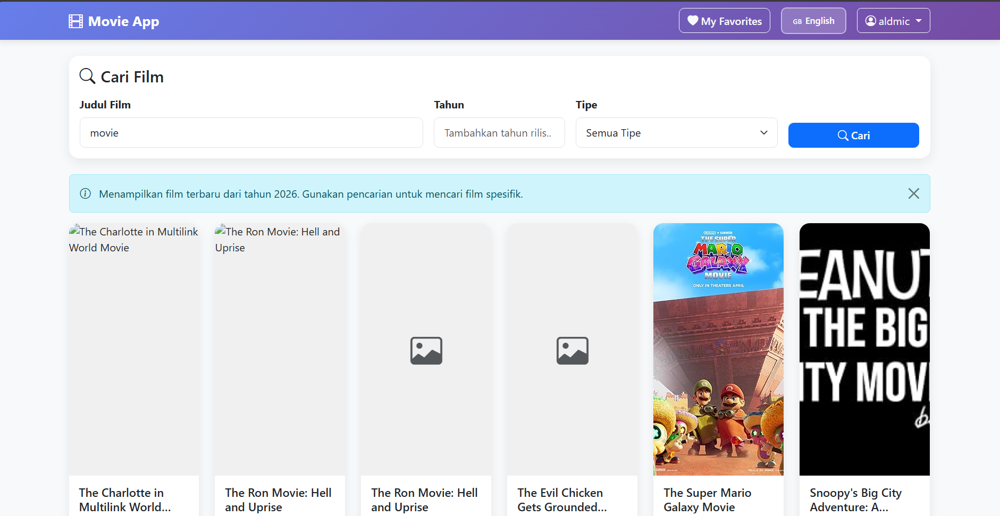
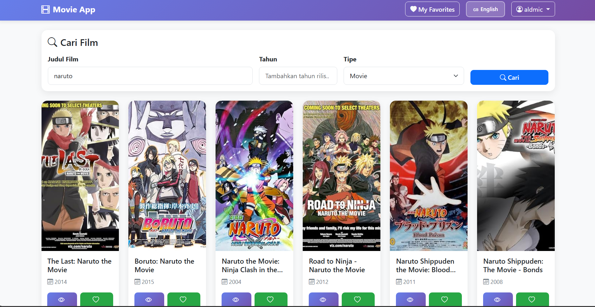

# Movie App 🎬

Aplikasi pencarian dan manajemen film favorit dengan Laravel 5.8 dan OMDB API. Aplikasi ini memungkinkan pengguna untuk mencari film, melihat detail film, dan menyimpan film favorit mereka dengan dukungan multi-bahasa.


## Preview





## Fitur ✨

### Core Features
- **🔍 Pencarian Film**: Cari film berdasarkan judul, tahun, dan tipe (Movie/Series/Episode)
- **🎬 Detail Film**: Lihat informasi lengkap film termasuk genre, rating, director, plot, dll
- **❤️ Favorite Movies**: Simpan film favorit Anda
- **🗑️ Kelola Favorite**: Tambah dan hapus film dari daftar favorite
- **🌍 Multi Bahasa**: Dukungan Bahasa Indonesia dan English dengan session-based locale
- **📜 Infinite Scroll**: Load more movies dengan AJAX scroll tanpa reload halaman
- **🏠 Tampilan Film Terbaru**: Menampilkan film terbaru saat tidak ada parameter pencarian
- **⬅️ Navigasi Kembali**: Tombol "Back to Home" dan "Back to Search" di halaman detail

### UI/UX Features
- **📱 Responsive Design**: Tampilan modern dengan Bootstrap 5 yang responsif
- **🎨 Gradient Theme**: Tema warna gradient purple yang modern
- **✨ Smooth Animations**: Hover effects dan transitions pada buttons dan cards
- **🎯 Badges**: Genre badges dengan berbagai warna
- **🔔 Alerts**: Flash messages untuk success/error/info
- **🔄 Loading States**: Loading indicator untuk infinite scroll

## Teknologi & Dependencies 🛠️

### Backend
| Package | Version | Description |
|---------|----------|-------------|
| **laravel/framework** | 5.8.* | Web Application Framework |
| **php** | ^7.1.3 | Programming Language |
| **laravel/tinker** | ^1.0 | Laravel REPL |
| **fideloper/proxy** | ^4.0 | Trusted Proxy Support |

### Frontend (CDN)
| Library | Version | Description |
|---------|----------|-------------|
| **Bootstrap** | 5.3.0 | CSS Framework untuk layout dan styling |
| **Bootstrap Icons** | 1.11.0 | Icon library untuk visual elements |
| **Vanilla JavaScript** | - | Tanpa framework JS tambahan |

### API External
- **OMDB API** - Open Movie Database API
  - Base URL: `http://www.omdbapi.com`
  - API Key: `205100` (Free tier) 
  note:daftar dulu ke link omdbapi.com diatas nanti key dikirim lewat email yang terdaftar
  - Endpoints:
    - Search: `?apikey=KEY&s=TITLE&page=PAGE`
    - Detail: `?apikey=KEY&i=IMDBID`

### Development Dependencies
| Package | Version | Description |
|---------|----------|-------------|
| **beyondcode/laravel-dump-server** | ^1.0 | Dump Server for debugging |
| **filp/whoops** | ^2.0 | Error handler |
| **fzaninotto/faker** | ^1.4 | Dummy data generator |
| **mockery/mockery** | ^1.0 | Mocking framework |
| **nunomaduro/collision** | ^3.0 | Error reporter for CLI |
| **phpunit/phpunit** | ^7.5 | Testing framework |

### Custom Helpers
- **LanguageHelper** (`app/Helpers/LanguageHelper.php`)
  - `msg()` function untuk translation helper
  - Mendukung parameter replacement

## Persyaratan Sistem 📋

### Requirements
- **PHP**: >= 7.1.3 (Recommended: 7.3)
- **Composer**: Latest stable
- **Database**: MySQL 5.7+ / MariaDB 10.2+
- **Web Server**: Laragon, XAMPP, atau sejenisnya
- **Extensions**: PHP extensions: OpenSSL, PDO, Mbstring, Tokenizer, XML, Ctype, JSON, BCMath

### Optional
- Node.js & NPM (jika ingin menggunakan Laravel Mix untuk asset compilation)

## Instalasi 🚀

### 1. Clone Repository

```bash
git clone <repository-url>
cd movie-app
```

### 2. Install Dependencies

```bash
# Install PHP dependencies
composer install
```

### 3. Konfigurasi Environment

Copy file `.env.example` ke `.env` dan sesuaikan:

```env
APP_NAME=MovieApp
APP_ENV=local
APP_KEY=base64:generated_key
APP_DEBUG=true
APP_URL=http://localhost:8000

LOG_CHANNEL=stack

DB_CONNECTION=mysql
DB_HOST=127.0.0.1
DB_PORT=3306
DB_DATABASE=movie_app
DB_USERNAME=root
DB_PASSWORD=
```

Generate application key:
```bash
php artisan key:generate
```

### 4. Buat Database

```sql
CREATE DATABASE movie_app;
```

Atau gunakan phpMyAdmin / tools lainnya.

### 5. Run Migrations

```bash
php artisan migrate
```

**Struktur Tabel:**
```sql
CREATE TABLE favorites (
    id BIGINT UNSIGNED AUTO_INCREMENT PRIMARY KEY,
    user VARCHAR(255) NOT NULL,
    imdbID VARCHAR(50) NOT NULL,
    title VARCHAR(255) NOT NULL,
    year VARCHAR(10) NOT NULL,
    poster TEXT,
    created_at TIMESTAMP NULL,
    updated_at TIMESTAMP NULL,
    UNIQUE KEY favorites_user_imdbid_unique (user, imdbID)
);
```

### 6. Clear Cache (Optional)

```bash
php artisan config:clear
php artisan view:clear
php artisan cache:clear
```

### 7. Run Development Server

```bash
php artisan serve
```

Aplikasi akan berjalan di `http://localhost:8000`

## Akun Demo 👤

```
Username: aldmic
Password: 123abc123
```

> **Note**: Ini adalah akun demo untuk testing. Autentikasi menggunakan session-based sederhana, bukan Laravel Auth.

## Penggunaan 📖

### Login

1. Buka halaman utama (`/` atau `/login`)
2. Masukkan username dan password
3. Klik tombol **Login**

### Mencari Film

1. Setelah login, Anda akan diarahkan ke halaman `/movies`
2. Secara default, menampilkan film terbaru dari tahun berjalan
3. Masukkan judul film yang ingin dicari
4. (Opsional) Filter berdasarkan tahun atau tipe
5. Klik tombol **Search** atau tekan Enter
6. Hasil akan menampilkan **10 film** per halaman dengan infinite scroll

### Infinite Scroll

- Scroll ke bawah untuk memuat lebih banyak film
- Loading indicator akan muncul saat mengambil data
- Tidak perlu klik "Next" - otomatis load next page

### Melihat Detail Film

1. Klik tombol **Detail** pada salah satu film
2. Informasi lengkap film akan ditampilkan:
   - Poster film (dengan placeholder jika tidak ada)
   - Genre (dengan badge warna-warni)
   - Rating IMDB (dengan bintang)
   - Tahun, Durasi, Negara
   - Director, Actors, Language
   - Plot/Sinopsis
   - Awards dan IMDB ID

### Menambah ke Favorite

**Dari Halaman Pencarian:**
- Klik tombol **🤍 Favorite** pada card film
- Tombol akan berubah menjadi **❤️ Favorited**

**Dari Halaman Detail:**
- Klik tombol **🤍 Add to Favorites**
- Tombol akan berubah menjadi **❤️ Remove from Favorites**

### Mengelola Favorite

1. Klik menu **❤️ My Favorites** di navbar
2. Anda akan melihat semua film yang disimpan
3. Klik **Detail** untuk melihat informasi film
4. Klik **Hapus** untuk menghapus dari favorite

### Multi Bahasa

- Klik tombol **🇬🇧 English** atau **🇮🇩 Indonesia** di navbar
- Bahasa akan berubah secara instan dan disimpan di session
- Tersedia di semua halaman (Login, Movies, Detail, Favorites)

## Routing 🛣️

### Authentication Routes
| Method | URI | Name | Controller | Action |
|--------|-----|------|-------------|---------|
| GET | `/login` | - | AuthController | showLogin |
| POST | `/login` | - | AuthController | login |
| GET | `/logout` | - | AuthController | logout |
| GET | `/language/{locale}` | language.set | AuthController | setLanguage |

### Movie Routes
| Method | URI | Name | Controller | Action |
|--------|-----|------|-------------|---------|
| GET | `/movies` | - | MovieController | index |
| GET | `/movies/load-more` | movies.loadMore | MovieController | loadMore |
| GET | `/movies/{id}` | - | MovieController | detail |

### Favorite Routes
| Method | URI | Name | Controller | Action |
|--------|-----|------|-------------|---------|
| GET | `/favorites` | - | FavoriteController | index |
| POST | `/favorites/add` | - | FavoriteController | add |
| POST | `/favorites/remove/{id}` | - | FavoriteController | remove |
| POST | `/favorites/toggle` | - | FavoriteController | toggle |

### Default Route
| Method | URI | Controller | Action |
|--------|-----|-------------|---------|
| GET | `/` | AuthController | showLogin |

## Database & Query 🗄️

### Data yang Disimpan
- **Informasi film favorit**: judul, tahun, IMDB ID, poster URL
- **Username** dari session login
- **Timestamp**: created_at dan updated_at

## Struktur Project 📁

```
movie-app/
├── app/
│   ├── Http/
│   │   ├── Controllers/
│   │   │   ├── AuthController.php      # Login, logout, language
│   │   │   ├── MovieController.php     # Search, detail, infinite scroll
│   │   │   └── FavoriteController.php  # CRUD favorites
│   │   └── Middleware/
│   │       └── Authenticate.php         # Auth middleware
│   ├── Models/
│   │   ├── User.php                    # User model
│   │   └── Favorite.php               # Favorite model
│   ├── Helpers/
│   │   └── LanguageHelper.php         # Translation helper
│   └── Providers/
│       ├── AppServiceProvider.php
│       ├── AuthServiceProvider.php
│       └── EventServiceProvider.php
├── resources/
│   ├── lang/
│   │   ├── en/
│   │   │   └── messages.php          # English translations
│   │   └── id/
│   │       └── messages.php          # Indonesian translations
│   └── views/
│       ├── auth/
│       │   └── login.blade.php       # Login page
│       ├── movies/
│       │   ├── index.blade.php       # Movie list/search with infinite scroll
│       │   └── detail.blade.php     # Movie detail with back buttons
│       ├── favorites/
│       │   └── index.blade.php       # Favorites list
│       └── layouts/
│           └── (optional)
├── routes/
│   └── web.php                      # Route definitions
├── database/
│   ├── migrations/
│   │   └── 2026_02_12_053546_create_favorites_table.php
│   └── seeds/
├── public/
│   └── (assets)
├── composer.json                     # PHP dependencies
├── .env                            # Environment configuration
└── README.md                       # This file
```

## API Reference 🔌

### OMDB API

Aplikasi menggunakan OMDB API untuk mengambil data film.

**Registration**: Daftar di http://www.omdbapi.com/apikey.aspx untuk mendapatkan API key gratis.

**Base URL**: `http://www.omdbapi.com/`

**Endpoints**:

1. **Search Movie**
   ```
   GET http://www.omdbapi.com/?apikey=KEY&s=TITLE&page=1
   GET http://www.omdbapi.com/?apikey=KEY&s=TITLE&y=YEAR&type=MOVIE
   ```

2. **Get Detail**
   ```
   GET http://www.omdbapi.com/?apikey=KEY&i=IMDB_ID
   ```

**Parameters**:
- `apikey`: API key (required)
- `s`: Search keyword (for search)
- `i`: IMDB ID (for detail)
- `y`: Year filter (optional)
- `type`: movie/series/episode (optional)
- `page`: Page number 1-100 (optional, default: 1)

**Response Format** (Search):
```json
{
  "Search": [
    {
      "Title": "Movie Title",
      "Year": "2024",
      "imdbID": "tt1234567",
      "Type": "movie",
      "Poster": "http://..."
    }
  ],
  "totalResults": "123",
  "Response": "True"
}
```

**Response Format** (Detail):
```json
{
  "Title": "Movie Title",
  "Year": "2024",
  "Rated": "PG-13",
  "Released": "01 Jan 2024",
  "Runtime": "120 min",
  "Genre": "Action, Drama",
  "Director": "Director Name",
  "Actors": "Actor 1, Actor 2",
  "Plot": "Movie plot...",
  "Language": "English",
  "Country": "USA",
  "Awards": "N/A",
  "Poster": "http://...",
  "imdbRating": "7.5",
  "imdbID": "tt1234567"
}
```

### Infinite Scroll Implementation
- JavaScript-based load more on scroll
- Fetch API untuk AJAX request
- Dynamic card creation
- Duplicate detection
- End message when no more results

### Multi-Language System
- Session-based locale (`session('locale')`)
- Blade directive: `{{ msg('key') }}`
- Parameter support: `{{ msg('key', ['param' => 'value']) }}`
- Switch via `/language/{locale}` route

### Search Parameter Preservation
- Search params preserved in detail page URL
- "Back to Search" button restores full search state
- Includes: search, year, type, genre, page

### Dynamic Poster Handling
- Fallback to placeholder if "N/A"
- Lazy loading ready
- Responsive image sizing

## Development Notes 📝

### Laravel Version Note
- Menggunakan Laravel 5.8 (rilis: 2019)
- Kompatibel dengan PHP 7.1 - 7.3
- Untuk PHP 8+, gunakan Laravel 8+

### Authentication
- Menggunakan session-based auth sederhana
- Bukan Laravel Auth package
- Username: `aldmic`, Password: `123abc123` (hardcoded di controller)

### Future Enhancements
- [ ] Laravel Sanctum untuk API auth
- [ ] Real-time notifications
- [ ] Movie reviews/ratings
- [ ] Watchlist functionality
- [ ] User profiles
- [ ] Admin panel

## Credits & Resources 🙏

### Frameworks & Libraries
- [Laravel 5.8](https://laravel.com/docs/5.8) - Web Application Framework
- [Bootstrap 5.3](https://getbootstrap.com/docs/5.3) - CSS Framework
- [Bootstrap Icons](https://icons.getbootstrap.com/) - Icon Library

### API
- [OMDB API](http://www.omdbapi.com/) - Open Movie Database

### Development Tools
- [Laragon](https://laragon.org/) - Local development environment
- [Composer](https://getcomposer.org/) - Dependency manager for PHP

### Inspiration
- Movie database concept from IMDB, TMDB


**Author**: Chucuyeah
**Version**: 1.0.0
**Last Updated**: 2026
